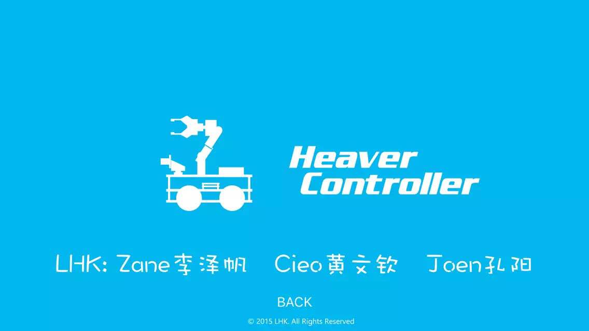
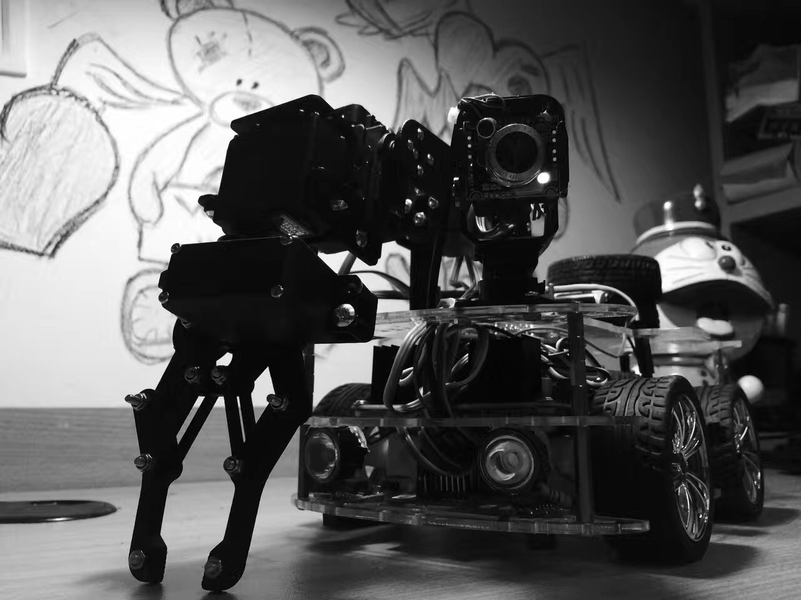

> This code is already out of date, just for demonstration purpose
> 这份代码已经跟不上时代了，只供参考

# MYO肌电控制小车的iOS控制APP

> **感谢兄弟文钦，孔阳**

基于FPGA开发的小车，上面装有摄像头和机械臂。使用Objective-C 编写的iOS端控制器能够显示小车回传的视频，操控小车的运动，开关灯等等。同时结合MYO SDK和MYO手环的肌电感应，实现了使用手势控制小车的功能。



